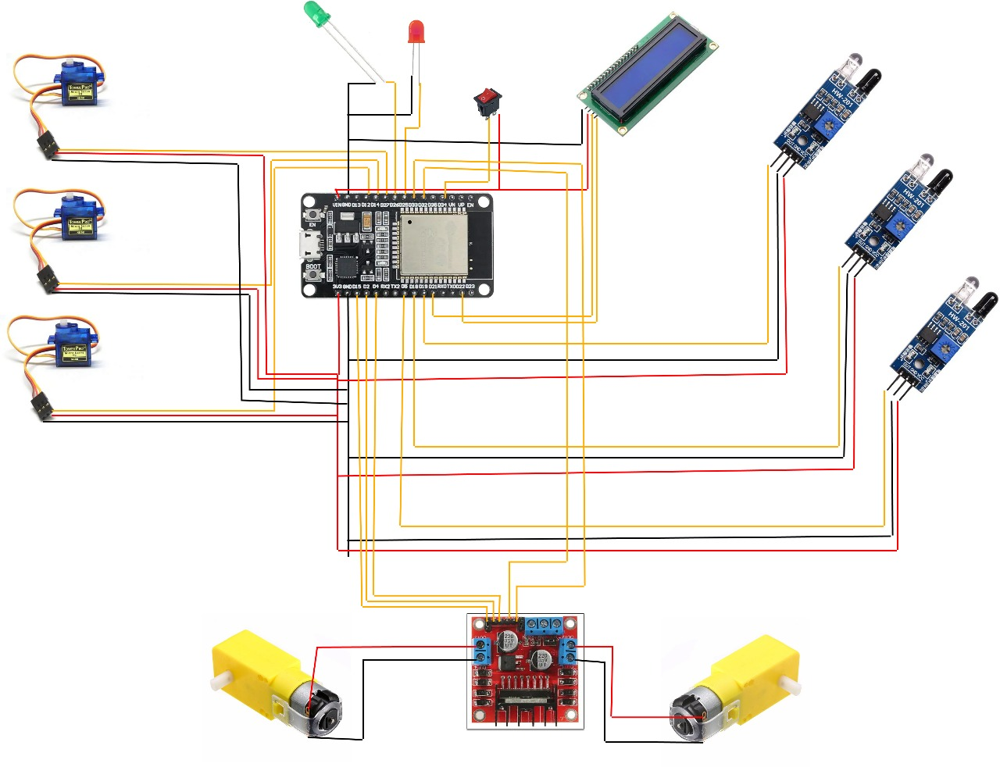
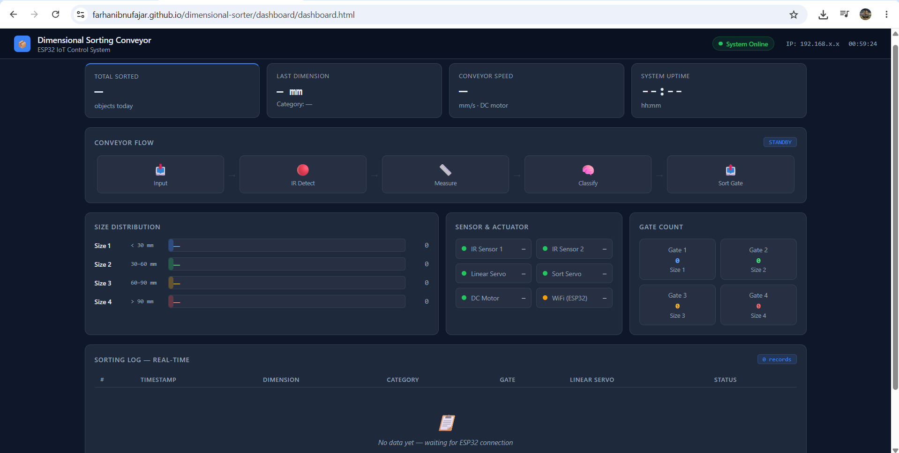

# 📦 Dimensional Sorting Conveyor System

An ESP32-based IoT system for automated dimensional measurement and object sorting on a conveyor line, with real-time monitoring via a web dashboard.

---

## 🔍 Overview

This project implements an automated conveyor-based sorting system that measures the physical dimensions of objects using a custom linear servo mechanism and IR sensors, then classifies and sorts them into 4 categories using servo actuators — all monitored in real time through a web dashboard built with HTML/JS.

The system reflects core principles used in industrial quality control and automated sorting lines in manufacturing environments.

---

## ⚙️ System Architecture

```
[Object on Conveyor]
        ↓
[IR Sensor — Object Detection]
        ↓
[Custom Linear Servo — Dimensional Measurement]
        ↓
[ESP32 — Classification Logic (C/C++ Firmware)]
        ↓
[Servo Actuator — Sorting Gate]     [DC Motor — Conveyor Drive]
        ↓
[Web Dashboard — Real-time Monitoring (HTML/JS)]
```

---

## 🛠️ Hardware Components

| Component | Function |
|---|---|
| ESP32 | Main microcontroller, WiFi, firmware logic |
| IR Sensor | Object presence detection on conveyor |
| Custom Linear Servo | Dimensional measurement of object |
| Servo Motor | Sorting gate actuator (4 categories) |
| DC Motor | Conveyor belt drive |

---

## 💻 Software & Tech Stack

| Layer | Technology |
|---|---|
| Firmware | C/C++ (Arduino framework) |
| Communication | WiFi — ESP32 Web Server |
| Dashboard | HTML / JavaScript |
| Schematic Design | Canva |

---

## 🔧 Features

- **Automated dimensional measurement** using custom linear servo mechanism
- **4-category object classification** based on measured dimensions
- **IR-based object detection** for conveyor trigger logic
- **Real-time web dashboard** accessible via local WiFi network
- **Servo-controlled sorting gate** for accurate object diversion
- **DC motor-driven conveyor** with firmware-controlled sequencing

---

## 📁 Repository Structure

```
dimensional-sorter/
├── source_code/
│   └── SOURCE_CODE_DIMENSIONAL_SORTING_CONVEYOR.ino          # Main ESP32 firmware (C/C++)
├── dashboard/
│   ├── index.html        # Web dashboard UI
│   └── style.css         # Dashboard styling
├── schematic/
│   └── schematic.jpeg     # PCB & wiring schematic (Canva)
├── docs/
│   └── images/           # System photos & diagrams
└── README.md
```

---

## 📸 Documentation

| System Overview | Web Dashboard | Sorting Mechanism |
|---|---|---|
|  |  | https://github.com/user-attachments/assets/fccf6079-f6f8-45e1-8b25-5f14aac8190a |

---

## 🚀 How to Run

1. **Clone this repository**
   ```bash
   git clone https://github.com/farhanibnufajar/dimensional-sorter.git
   ```

2. **Open firmware in Arduino IDE**
   - Open `source_code/SOURCE_CODE_DIMENSIONAL_SORTING_CONVEYOR.ino`
   - Install ESP32 board support via Boards Manager
   - Install required libraries (listed in firmware header)

3. **Configure WiFi credentials**
   ```cpp
   const char* ssid     = "YOUR_WIFI_SSID";
   const char* password = "YOUR_WIFI_PASSWORD";
   ```

4. **Upload firmware to ESP32**
   - Select board: `ESP32 Dev Module`
   - Upload via USB

5. **Access dashboard**
   - Open Serial Monitor to get ESP32 IP address
   - Open browser → enter IP address
   - Dashboard loads automatically

---

## 📐 Classification Logic

| Category | Dimension Range | Sorting Gate Position |
|---|---|---|
| Size 1 (Small) | < threshold 1 | Gate position 1 |
| Size 2 (Medium) | threshold 1–2 | Gate position 2 |
| Size 3 (Large) | threshold 2–3 | Gate position 3 |
| Size 4 (Oversized) | > threshold 3 | Gate position 4 |

> Thresholds are configurable in firmware.

---

## 👤 Author

**Farhan Ibnufajar**
Electrical Engineering — Universitas Jenderal Soedirman (Unsoed)

[](https://github.com/farhanibnufajar)
[](https://farhanibnufajar.github.io)

---

## 📄 License

This project is open source and available under the [MIT License](LICENSE).
